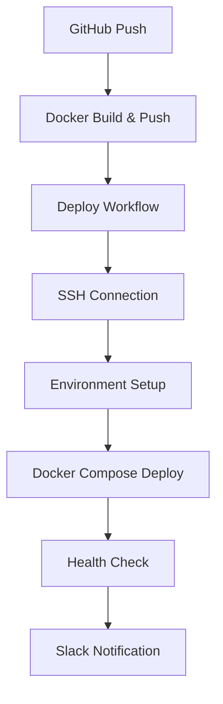

# KAMF 배포 가이드

## 📋 개요

이 가이드는 KAMF 프로젝트를 SSH 연결 가능한 리눅스 서버에 배포하는 방법을 설명합니다.

## 🏗️ 배포 아키텍처



## 🖥️ 서버 요구사항

### 최소 시스템 요구사항
- **OS**: Ubuntu 20.04+ (권장: Ubuntu 22.04)
- **CPU**: 2 코어 이상
- **메모리**: 4GB 이상 (권장: 8GB)
- **디스크**: 20GB 이상 여유 공간
- **네트워크**: 고정 IP 또는 도메인

### 필요 포트
- **22**: SSH 접근
- **80**: HTTP 트래픽
- **443**: HTTPS 트래픽 (SSL 사용 시)

## 🚀 배포 설정 단계

### 1단계: 서버 초기 설정

```bash
# 서버에 접속
ssh user@your-server-ip

# 초기 설정 스크립트 다운로드 및 실행
curl -sSL https://raw.githubusercontent.com/your-username/kamf/main/deploy/scripts/setup-server.sh | bash

# 또는 저장소 클론 후 실행
git clone https://github.com/your-username/kamf.git
cd kamf
chmod +x deploy/scripts/setup-server.sh
./deploy/scripts/setup-server.sh
```

### 2단계: SSH 키 설정

```bash
# 로컬에서 SSH 키 생성
ssh-keygen -t rsa -b 4096 -C "github-actions@kamf" -f ~/.ssh/kamf_deploy_key

# 공개키를 서버에 등록
ssh-copy-id -i ~/.ssh/kamf_deploy_key.pub user@your-server-ip

# 또는 수동으로 등록
cat ~/.ssh/kamf_deploy_key.pub | ssh user@your-server-ip "mkdir -p ~/.ssh && cat >> ~/.ssh/authorized_keys"
```

### 3단계: GitHub Secrets 설정

GitHub 저장소 → Settings → Secrets and variables → Actions → New repository secret

#### 🖥️ 서버 연결 정보
```bash
SERVER_HOST=your.server.ip.address
SERVER_USERNAME=your_ssh_username
SERVER_SSH_KEY=[개인키 전체 내용을 복사하여 붙여넣기]
SERVER_PORT=22
```

#### 🐳 Docker Registry
```bash
DOCKERHUB_USERNAME=your_dockerhub_username
DOCKERHUB_TOKEN=your_dockerhub_access_token
```

#### 🌐 Application URLs
```bash
CORS_ORIGIN_PROD=https://your-domain.com
NEXT_PUBLIC_API_URL_PROD=https://your-domain.com
NEXT_PUBLIC_APP_URL_PROD=https://your-domain.com
```

#### 🗄️ Database
```bash
DB_USERNAME=kamf_user
DB_PASSWORD=[보안 패스워드 생성]
DB_NAME=kamf_prod
MYSQL_ROOT_PASSWORD=[보안 루트 패스워드 생성]
```

#### 🔐 JWT & Authentication
```bash
JWT_SECRET=[openssl rand -base64 32로 생성]
REFRESH_TOKEN_SECRET=[openssl rand -base64 32로 생성]
NEXTAUTH_SECRET=[openssl rand -base64 32로 생성]
```

#### 📱 Twilio SMS
```bash
TWILIO_ACCOUNT_SID=ACxxxxxxxxxxxxxxxxxxxxxxxxxxxxxxxx
TWILIO_AUTH_TOKEN=your_twilio_auth_token
TWILIO_SERVICE_SID=your_twilio_service_sid
```

#### 📢 알림 (선택사항)
```bash
SLACK_WEBHOOK_URL=https://hooks.slack.com/services/...
```

### 4단계: 도메인 및 SSL 설정 (선택사항)

```bash
# 서버에서 SSL 인증서 발급
sudo certbot --nginx -d your-domain.com

# 자동 갱신 확인
sudo certbot renew --dry-run
```

## 🔄 배포 프로세스

### 자동 배포
1. `main` 브랜치에 코드 푸시
2. Docker 빌드 & 푸시 워크플로우 자동 실행
3. 빌드 성공 시 배포 워크플로우 자동 트리거
4. 서버에 자동 배포 및 헬스체크
5. Slack 알림 발송

### 수동 배포
```bash
# GitHub Actions에서 수동 트리거
# Deploy to Server 워크플로우 → Run workflow → 이미지 태그 선택
```

### 로컬에서 배포 테스트
```bash
# 서버에서 직접 배포 테스트
cd ~/kamf/deploy

# 환경변수 설정 (실제 값으로 수정 필요)
export DOCKER_REGISTRY=your_dockerhub_username
export IMAGE_TAG=latest
export DB_PASSWORD=your_secure_password
# ... 기타 필요한 환경변수들

# 배포 실행
./scripts/deploy.sh
```

## 🔍 모니터링 및 트러블슈팅

### 컨테이너 상태 확인
```bash
cd ~/kamf/deploy
docker-compose ps
docker-compose logs -f
```

### 개별 서비스 로그 확인
```bash
docker-compose logs -f api
docker-compose logs -f web
docker-compose logs -f mysql
docker-compose logs -f nginx
```

### 헬스체크
```bash
# API 헬스체크
curl -f http://localhost/api/health

# Web 애플리케이션 확인
curl -f http://localhost/

# 전체 서비스 상태
docker ps
```

### 일반적인 문제 해결

#### 1. 컨테이너가 시작되지 않는 경우
```bash
# 로그 확인
docker-compose logs service_name

# 포트 충돌 확인
sudo netstat -tlnp | grep :80

# 디스크 공간 확인
df -h
```

#### 2. 데이터베이스 연결 실패
```bash
# MySQL 컨테이너 상태 확인
docker-compose exec mysql mysql -u$DB_USERNAME -p$DB_PASSWORD -e "SELECT 1"

# 네트워크 연결 확인
docker-compose exec api ping mysql
```

#### 3. SSL 인증서 문제
```bash
# 인증서 유효성 확인
sudo certbot certificates

# 인증서 갱신
sudo certbot renew

# Nginx 설정 테스트
sudo nginx -t
```

## 📊 성능 최적화

### 이미지 최적화
- Docker 멀티스테이지 빌드 활용
- 불필요한 패키지 제거
- .dockerignore 파일 활용

### 메모리 관리
```bash
# 메모리 사용량 모니터링
docker stats

# 사용하지 않는 이미지 정리
docker system prune -a

# 로그 크기 제한
echo '{"log-driver":"json-file","log-opts":{"max-size":"10m","max-file":"3"}}' | sudo tee /etc/docker/daemon.json
sudo systemctl restart docker
```

### 백업 전략
```bash
# 데이터베이스 백업
docker-compose exec mysql mysqldump -u$DB_USERNAME -p$DB_PASSWORD $DB_NAME > backup_$(date +%Y%m%d_%H%M%S).sql

# 설정 파일 백업
tar -czf config_backup_$(date +%Y%m%d).tar.gz deploy/ .env*
```

## 🚨 보안 고려사항

### 필수 보안 설정
- [ ] SSH 키 기반 인증 사용
- [ ] 불필요한 포트 차단 (UFW)
- [ ] 강력한 데이터베이스 패스워드
- [ ] 정기적인 시스템 업데이트
- [ ] Docker 컨테이너 non-root 실행
- [ ] 로그 접근 권한 관리

### 모니터링
```bash
# 실패한 로그인 시도 확인
sudo grep "Failed password" /var/log/auth.log

# Docker 보안 스캔
docker scan your_image:tag

# 시스템 리소스 모니터링
htop
iotop
```

---

## 📞 지원 및 문의

문제가 발생하거나 도움이 필요한 경우:
1. GitHub Issues에서 이슈 생성
2. 로그 파일 첨부 (`docker-compose logs`)
3. 시스템 정보 포함 (`uname -a`, `docker --version`)

---

**마지막 업데이트**: 2025년 1월
